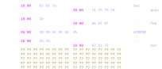
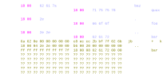
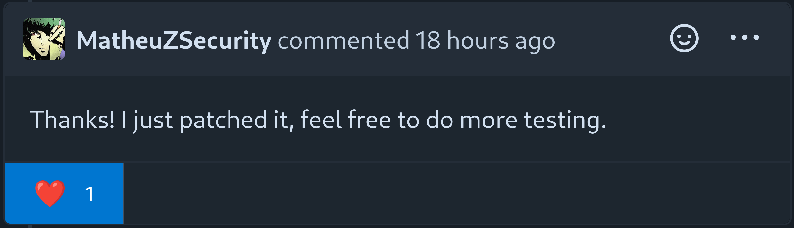

#+TITLE: Linux Rootkit Detection
#+SUBTITLE: Know where to look in user space
#+AUTHOR: Hilko Bengen
#+DATE: 2026-09-14

* Agenda

- How do Unix/Linux rootkits work?
- How can we detect rootkits?
- Novel techniques
- Hunting at scale

* What?

- Goal: Post breach, keep access, stay undetected
- Today: Stealth; hiding processes, files, file contents, network activity
- Evolution in implementations
  - trad: replace system binarie:  =ps(1)=, =ls(1)=, etc.
  - libc hooks, dynamic linker subversion
  - kernel modules
  - BPF hooks

* Hiding stuff: Files, processes

- Goal: hide scripts or exfil stash from =ls(1)= or =find(1)=
- Technique: hook directory reading calls: Remove specific entries are removed from returned buffers
- Also works for processes: =/proc/$PID/= directory entries

* Hooking =getdents64= (1)

- =getdents= = "get directory entries"
- More efficient variant of the old =readdir= syscall: Writes multiple directory entries into user-provided buffer

#+begin_src
  ssize_t getdents64(int fd, void dirp[.count], size_t count);  

  struct linux_dirent64 {
      ino64_t        d_ino;    /* 64-bit inode number */
      off64_t        d_off;    /* Not an offset; see getdents() */
      unsigned short d_reclen; /* Size of this dirent */
      unsigned char  d_type;   /* File type */
      char           d_name[]; /* Filename (null-terminated) */
  };
#+end_src

* Hooking =getdents64= (2)

Read a directory containing =foo bar baz quux HIDEME=:
#+ATTR_HTML: :height 400px

* Hooking =getdents64= (3)

libc hook or syscall hook copies remaining data over =HIDEME=, reduces buffer size:
#+ATTR_HTML: :height 400px

* Hiding stuff: file contents

- Goal: hide suspicious configuration or scripts
- Technique: Hook =read= call, recognize start, end markers
- For example, parts of a patched init script
  #+begin_src bash
    #<HIDE_USER>
    if [ -e rootkit.ko ]; then
        /sbin/insmod rootkit.ko
    fi
    #</HIDE_USER>
  #+end_src

* General detection strategy

- Don't worry about IoCs for specific rootkits
- Files, processes are still there
- We just have to find them
- Trace elements may be enough!
- We can compare results from different methods

* Process, thread enumeration

- Brute-forcing is feasible! $pid\_max \le 4194304$
- Open or change directory to =/proc/$PID=
- Many syscalls operate on a process ID. "No error" or anything
  permission-related = process/thread exists.

=kill pidfd_open getpgid getpriority getsid ioprio_get prlimit64 rt_sigqueueinfo rt_tgsigqueueinfo sched_getaffinity sched_getattr sched_getparam sched_getscheduler sched_rr_get_interval=

* Detecting file content masking

#+begin_src bash
  #<HIDE_USER>
  if [ -e rootkit.ko ]; then
      /sbin/insmod rootkit.ko
  fi
  #</HIDE_USER>
#+end_src

- Naïve tag-based hiding does not work with small buffers
- Read hooks don't affect memory-mapped file access
- Mismatch between apparent file size and bytes read

* New process enumeration techniques

- Recursively enumerate process children
  - starting with =init= and =kthreadd= (pid 1, 2)
  - =/proc/$PID/task/$TID/children=
- Enumerate processes and threads in cgroups
  - =/sys/fs/cgroup/*/cgroup.threads=

* New file enumeration technique

- Hook code overwrite parts of buffer before returning control to calling code
- Let's call =getdents64= with mininal buffer sizes that will hold at most 1 entry
- Hooked call can't just return an empty buffer: return code 0 = end of directory

* Hunting at scale

- Run tools with these techniques on the wohle fleet
- No external dependencies, please.
- Would like machine-readable parseable output

* Existing tools

- [[http://rkhunter.sourceforge.net/][rkhhunter]] (shell+Perl): checks for indicators of well-known rootkits
- [[http://www.chkrootkit.org/][chkrootkit]] (shell+C): checks for modified system binaries, utmp/wtmp/lastlog deletions, network interfaces in promiscuous mode, signs of kernel modules
- [[https://www.unhide-forensics.info][unhide]] (C): implementation of various brute force and syscall scanning
  techniques
- [[https://launchpad.net/unhide.rb][unhide.rb]] (Ruby): Reimplementation of unhide

* =rk-expose=

- Smallish (< 1MB) statically linked Rust binary
- Various techniques whose results can be compared
  - 5 process listing + 15 process brute-forcing methods
  - 3 file listing methods
  - 4 file content read methods
- JSON or "human readable" output
- "Auto" mode that tells us the kind of rootkit found
- Velociraptor integration
- Available at https://codeberg.org/hillu/rk-expose, GPLv3

#+ATTR_HTML: :height 
[[file:project-url.svg]]

* =rk-expose=

Finding hidden processes:

#+begin_src
# rk-expose ps-diff
Differences between: [children, getdents, readdir]
- Extra processes found using 'children':
  -    3273  boopkit           /usr/bin/boopkit
  -    3274  boopkit           /usr/bin/boopkit
- Extra processes found using 'getdents':
  -    3273  boopkit           /usr/bin/boopkit
  -    3274  boopkit           /usr/bin/boopkit
- No anomalies found using 'readdir'
#+end_src

Finding hidden files:

#+begin_src 
$ rk-expose ls-diff .
Differences between: [getdents, readdir]
- Extra paths found using 'getdents':
  - - ./diamorphine_secret_file
- No anomalies found using 'readdir'
#+end_src

* Limits/Caveats (1)

- General warning: "No findings" does not mean "no adversary"!
- Looking for anomalies at the surface does not catch more elaborate illusions
  - The [[https://github.com/MatheuZSecurity/Singularity][MatheuZSecurity/Singularity]] rootkit is being actively developed and a space to watch
- There may be other robust ways to hide directory entries
  - (I'm only aware of utterly broken ones)
- Looking for traces of "missing" processes does not help against process blend-in techniques

* Limits/Caveats (2)

- Attack/defense may have an arms race component
- cf. [[https://codeberg.org/hillu/rk-expose/issues/36][Issue #36]] "Singularity is not getting detected"
  #+ATTR_HTML: :height 
  
  
* What's next

- More techniques around anomalies, e.g.:
  - file sizes
  - directory link counts
  - non-procfs filesystem for =/proc/$PID=
- eBPF
  - iterator-based process enumeration
  - watch internals while =getdents64= is running
- Direct disk access for file enumeration
  - easy for ext4 file systems
- I'd like to hear about your ideas!

* Thank you for your attention

Slides will be published at https://hillu.github.io/conference-materials/balccon-2k26/slides.reveal.html

#+ATTR_HTML: :height 
[[file:talk-url.svg]]

Contact me at

Hilko Bengen <[[mailto:bengen@hilluzination.de][bengen@hilluzination.de]]> @hillu@infosec.exchange @hillu_.matrix.org 
